# Task 1

*The files `w-gs3yr.txt` and `w-gs1yr.txt` give the weekly interest rates for US Treasury 1 year and 3 year constant maturity rate. We want to see how they are related. These files may be found on the course page.* 


```r
www_w.gs1yr = "https://www.mimuw.edu.pl/~noble/courses/TimeSeries/data/w-gs1yr.txt"
w.gs1yr <- read.table(www_w.gs1yr, header=T)
www_w.gs3yr = "https://www.mimuw.edu.pl/~noble/courses/TimeSeries/data/w-gs3yr.txt"
w.gs3yr <- read.table(www_w.gs3yr, header=T)
```

*After loading them, type*


```r
r1 <- w.gs1yr$rate
r3 <- w.gs3yr$rate
m1 <- lm(r3~r1)
summary(m1)
```

```
## 
## Call:
## lm(formula = r3 ~ r1)
## 
## Residuals:
##      Min       1Q   Median       3Q      Max 
## -1.82319 -0.37691 -0.01462  0.38661  1.35679 
## 
## Coefficients:
##             Estimate Std. Error t value Pr(>|t|)    
## (Intercept)  0.83214    0.02417   34.43   <2e-16 ***
## r1           0.92955    0.00357  260.40   <2e-16 ***
## ---
## Signif. codes:  0 '***' 0.001 '**' 0.01 '*' 0.05 '.' 0.1 ' ' 1
## 
## Residual standard error: 0.5228 on 2465 degrees of freedom
## Multiple R-squared:  0.9649,	Adjusted R-squared:  0.9649 
## F-statistic: 6.781e+04 on 1 and 2465 DF,  p-value: < 2.2e-16
```
*and interpret the output.*

### Output interpretation

Based on the p-value (< 2.2e-16) we can assume that there is a highly statistically significant relationship between `w.gs1yr$rate` and `w.gs3yr$rate`. The residuals do appear to be strongly symmetrically distributed across these points on the mean values zero. That means that the model predicts certain points close to the actuak observed points. Estimate values are our linear regression coefficients. We can see how it looks on our dataset on the plot below. 


```r
plot(r1, r3)
abline(m1$coefficients[1], m1$coefficients[2], col="red")
```

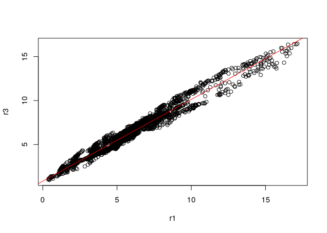<!-- -->

<br>
The coefficient Standard Error measures the average amount that the coefficient estimates vary from the actual average value of our response variable. In our case it's relatively small. Three stars at the end of line represent a highy significant p-value.
<br>

The R-squared (\(R^2\) statistic provides a measure of how well the model is fitting the actual data. It takes the form of a proportion of variance. \(R^2\) is a measure of the linear relationship between our predictor variable and our response / target variable. It always lies between 0 and 1 (i.e.: a number near 0 represents a regression that does not explain the variance in the response variable well and a number close to 1 does explain the observed variance in the response variable). In our example, the \(R^2\) we get is  0.9649. Or roughly 96% of the variance found in the response variable can be explained by the predictor variable.
<br>

F-statistic is a good indicator of whether there is a relationship between our predictor and the response variables. The further the F-statistic is from 1 the better it is. n our example the F-statistic is 6.781e+04 which is relatively larger than 1 given the size of our data.


```r
plot(m1$residuals, type='l')
```

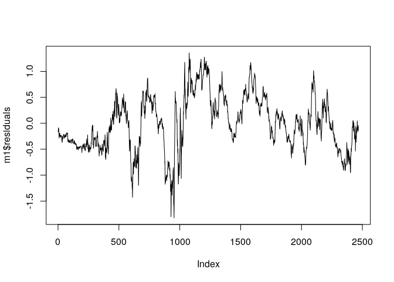<!-- -->

```r
acf(m1$residuals, lag=36)
```

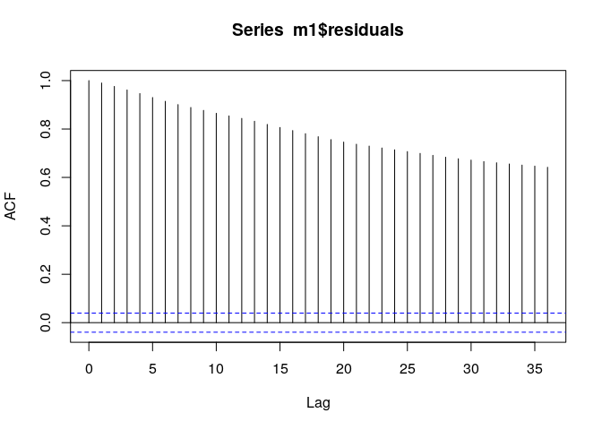<!-- -->

```r
c1 = diff(r1)
c3 = diff(r3)
m2 = lm(c3~-1+c1)
summary(m2)
```

```
## 
## Call:
## lm(formula = c3 ~ -1 + c1)
## 
## Residuals:
##      Min       1Q   Median       3Q      Max 
## -0.42469 -0.03589 -0.00127  0.03456  0.48911 
## 
## Coefficients:
##    Estimate Std. Error t value Pr(>|t|)    
## c1 0.791935   0.007337   107.9   <2e-16 ***
## ---
## Signif. codes:  0 '***' 0.001 '**' 0.01 '*' 0.05 '.' 0.1 ' ' 1
## 
## Residual standard error: 0.06896 on 2465 degrees of freedom
## Multiple R-squared:  0.8253,	Adjusted R-squared:  0.8253 
## F-statistic: 1.165e+04 on 1 and 2465 DF,  p-value: < 2.2e-16
```

*and interpret the output*


### Output interpretation


```r
r1.ts = ts(r1)
r3.ts = ts(r3)
plot(r1.ts)
```

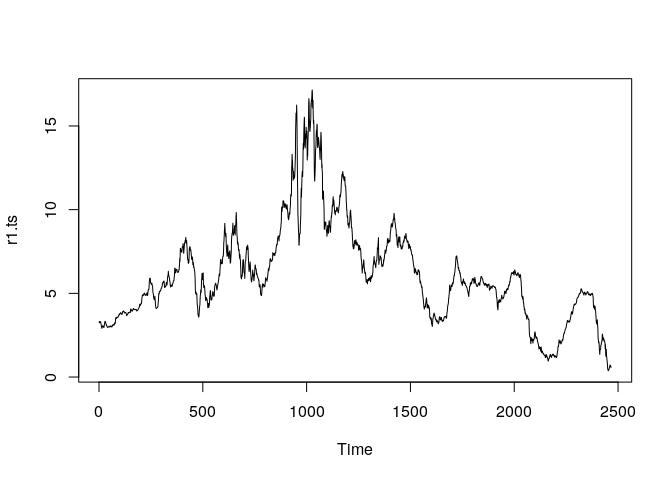<!-- -->

```r
plot(r3.ts)
```

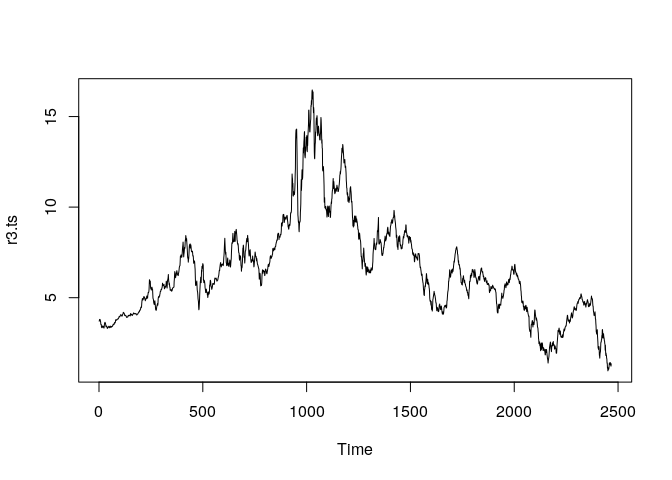<!-- -->

```r
cor(r1, r3)
```

```
## [1] 0.9823052
```
<br>
The two time series are highly correlated, as can be seen in the plots, with a
correlation coefficient of 0.98. The two time series also happen to have similar seasonal variations. For these reasons, it is usually appropriate to remove trends and seasonal effects before comparing multiple series. This is often achieved by working with the residuals of a regression model that has deterministic terms to represent the trend and seasonal effects. W our case the residuals are `c1` and `c3`. We can also see the correlation on ACF plot.
<br>

When it comes to interpretatation of linaer regression, the conclusions are similar to the ones in the first part. We can see line fitted to our residuals in the plot below:


```r
plot(c1, c3)
abline(0, 0.9791935, col="red")
```

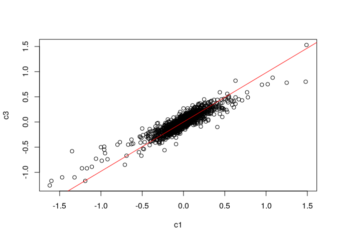<!-- -->


```r
acf(m2$residuals, lag=36)
```

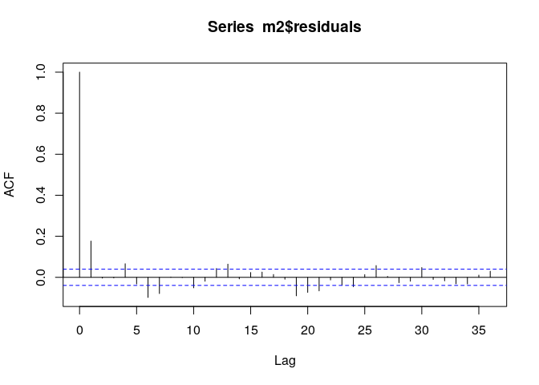<!-- -->

```r
m3=arima(c3, order=c(0,0,1), xreg=c1, include.mean = F)
m3
```

```
## 
## Call:
## arima(x = c3, order = c(0, 0, 1), xreg = c1, include.mean = F)
## 
## Coefficients:
##          ma1      c1
##       0.1823  0.7936
## s.e.  0.0196  0.0075
## 
## sigma^2 estimated as 0.0046:  log likelihood = 3136.62,  aic = -6267.23
```

*and interpret the output*


### Output interpretation

On this plot we can see that there is a statistically significant correlation at lag 1.
An exponential decay in the correlogram is typical of a first-order autoregressive model, however we chose to fit our data to MA(1) model. We can chceck our model behaviur on the plot below.


```r
checkresiduals(m3)
```

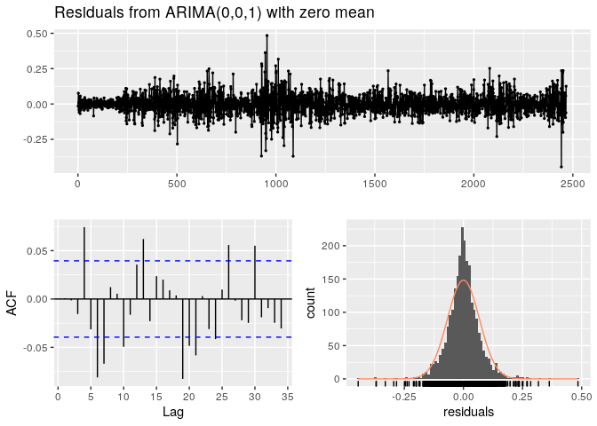<!-- -->

```
## 
## 	Ljung-Box test
## 
## data:  Residuals from ARIMA(0,0,1) with zero mean
## Q* = 50.62, df = 8, p-value = 3.106e-08
## 
## Model df: 2.   Total lags used: 10
```


```r
rsq = (sum(c3^2) - sum(m3$residuals^2))/sum(c3^2)
rsq
```

```
## [1] 0.8310077
```
In statistics, the coefficient of determination represents the strength of the relationship or the portion of common variation in two time-series or variables. It is a statistical measure of how well the regression line approximates the real values. The coefficient of determination or \(R^2\) is mainly used to analyze how well a variable can predict another one. The returned value gives us the percentage of change of variable X that can be explained by changes in variable Y. In our case the coefficient of determination is equal to 0.8310077 or 83.1%, which means that changes can explain 83.1% of next changes.


### Output interpretation

TO DO


*Can you devise a profitable trading strategy based on the behaviour of the two series?*

# Task 2

*The data for this exercise is found on the course page in the file `sp5may.dat`. It has 3 columns: log(futures price), log(spot price) anf cost-of-carry (\(\times\) 100). The time interval is 1 minute. Let \(f_t\) and \(s_t\) be the log prices of future and spot respectively (from columns 1 and 2). Consider \(y_t = f_t = f_{t-1}\) and \(x_t = s_t - s_{t-1}\). Build a regression model, with time series errors, between \(\{y_t\}\) and \(\{x_t\}\) where \(\{y_t\}\) is the dependent variable. That is:*

<br>

*Find a model \(y_t = \beta_0 + \beta_1x_t + \varepsilon_t\); what are the estimates of \(\bata_0\) and \(\beta_1\)*


```r
www_sp5may <-"https://www.mimuw.edu.pl/~noble/courses/TimeSeries/data/sp5may.dat"
sp5may <- read.table(www_sp5may, header=TRUE)
```


```r
plot(sp5may$lnfuture, sp5may$lnspot)
```

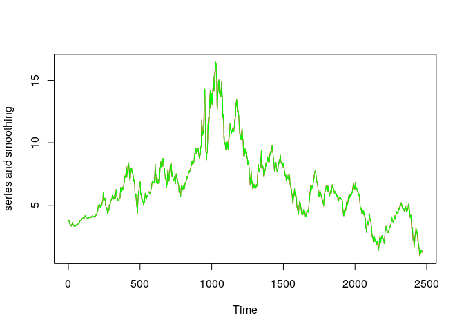<!-- -->

```r
sp5may.ts=ts(sp5may, fr=60)
plot(sp5may.ts)
```

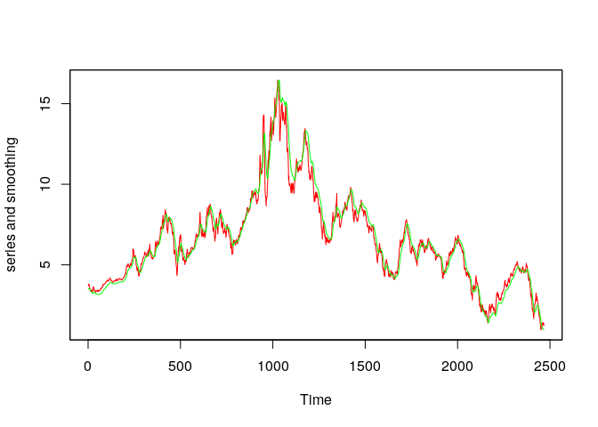<!-- -->


```r
y = diff(sp5may$lnfuture)
x = diff(sp5may$lnspot)

lr = lm(y~x)
a = arima(y, xreg=x, order=c(1,0,0)) #AR(1) error
a
```

```
## 
## Call:
## arima(x = y, order = c(1, 0, 0), xreg = x)
## 
## Coefficients:
##           ar1  intercept       x
##       -0.0641          0  0.6212
## s.e.   0.0119          0  0.0173
## 
## sigma^2 estimated as 8.654e-08:  log likelihood = 47389.31,  aic = -94770.63
```

```r
plot(y, x)
abline(1.354e-06, 6.212e-01, col="red")
abline(0, 0.6212, col="blue")
```

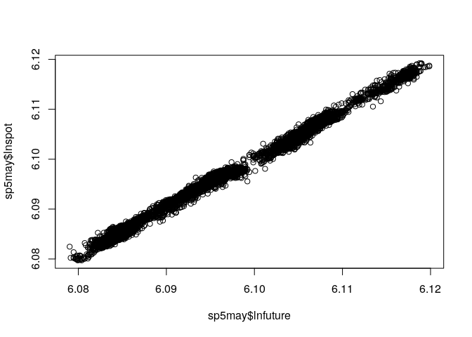<!-- -->
*Stre the residuals.*
<br>
*- Is 'white noise' a good model for the residuals?*
<br>
*- Try fitting an ARMA model to the residuals. Does an ARMA(p,q) process give a better model than the 'white noise' model?*
<br>
*- If you restrict model selection to AR(p), is there satisfactoty AR(p) model which represents an improvement over white noise?*


```r
sd(x)
```

```
## [1] 0.0002000786
```

```r
sd(y)
```

```
## [1] 0.0003199404
```

```r
auto.arima(y, xreg=x)
```

```
## Series: y 
## Regression with ARIMA(1,0,2) errors 
## 
## Coefficients:
##          ar1      ma1      ma2    xreg
##       0.8084  -0.9106  -0.0212  0.7264
## s.e.  0.0158   0.0196   0.0141  0.0177
## 
## sigma^2 estimated as 8.391e-08:  log likelihood=47500.14
## AIC=-94990.28   AICc=-94990.27   BIC=-94955.97
```
based on log likelihood, ARMA(1,2) seems to perform slightly better

```r
auto.arima(y, xreg=x, max.d = 0, max.q = 0)
```

```
## Series: y 
## Regression with ARIMA(5,0,0) errors 
## 
## Coefficients:
##           ar1      ar2      ar3      ar4      ar5    xreg
##       -0.0795  -0.0746  -0.0682  -0.0741  -0.0498  0.6532
## s.e.   0.0119   0.0119   0.0120   0.0119   0.0120  0.0168
## 
## sigma^2 estimated as 8.538e-08:  log likelihood=47440.22
## AIC=-94866.44   AICc=-94866.43   BIC=-94818.41
```
AR(5) is slightly better than AR(1)
<br>
*Use the command `gls` (generalised least squares) from the package `nlme` and for the residuals, ude `correlation=corARMA(p=?, q=?)` with the values p and q which you obtained when finding a suitable ARMA process for the residuals. Are \(\beta_0\) and \(\beta_1\) substantially different? Is the \(\sigma^2\) estimate substantially different?*


```r
# gls(y~x, correlation = corARMA(p=1, q=2))
```


# Task 3

*The data for this excercise is found in the file `q-gdpdef.txt` on the course page. It contains the data for the United States for the first quater of 1947 to the last quater of 2008. Data is in the format year, month, day and deflator. The data are seasionally adjusted and equal to 100 for the year 2000. Build ARIMA model for the serier and check the validity of the fitted model. Use the fitted model to predict the inflation for each quater of 2009.*


```r
www_q.gdpdef = "https://www.mimuw.edu.pl/~noble/courses/TimeSeries/data/q-gdpdef.txt"
q.gdpdef <- read.table(www_q.gdpdef, header=T)
q.gdpdef.ts <- ts(q.gdpdef$gdpdef, frequency=4, start = c(1947, 1))
plot(q.gdpdef.ts)
```

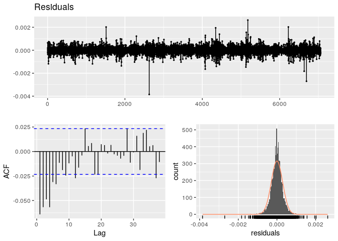<!-- -->

```r
auto.arima(q.gdpdef.ts)
```

```
## Series: q.gdpdef.ts 
## ARIMA(0,2,1)(2,0,1)[4] 
## 
## Coefficients:
##           ma1     sar1    sar2    sma1
##       -0.6041  -0.4409  0.0764  0.6017
## s.e.   0.0523   0.5131  0.1151  0.5053
## 
## sigma^2 estimated as 0.02844:  log likelihood=90.57
## AIC=-171.15   AICc=-170.9   BIC=-153.62
```

```r
plot(q.gdpdef$gdpdef)
```

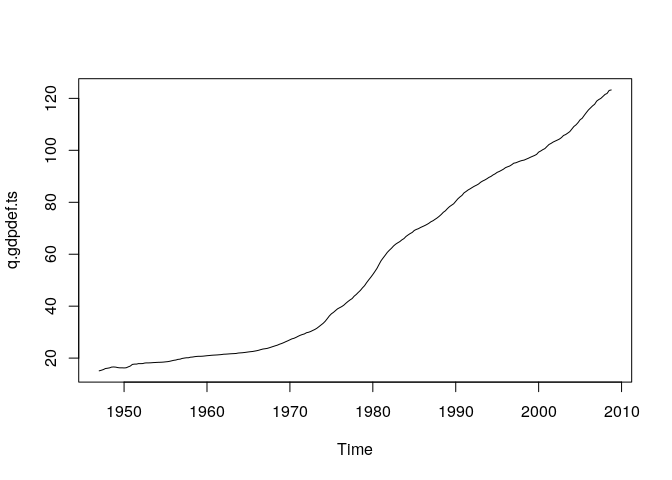<!-- -->


```r
fit <- Arima(q.gdpdef.ts, order=c(0,2,1))
plot(fit$x,col="blue")
lines(fitted(fit),col="red")
```

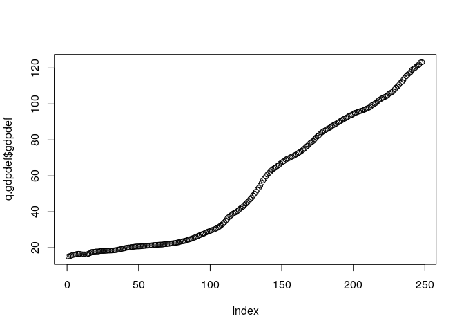<!-- -->

```r
# such valid so good

autoplot(forecast(fit))
```

<!-- -->
