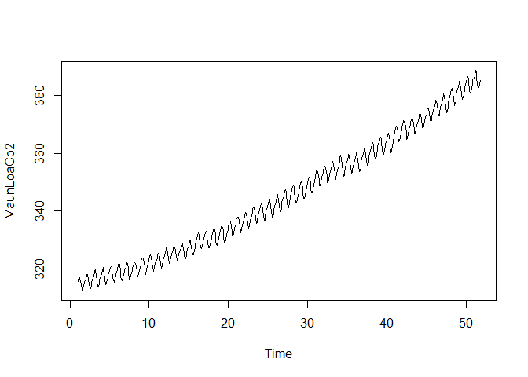
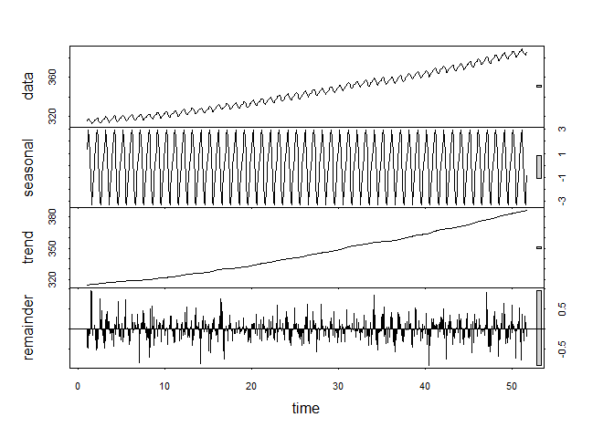
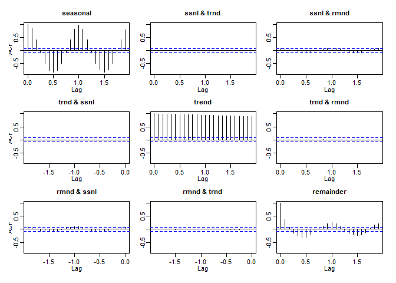
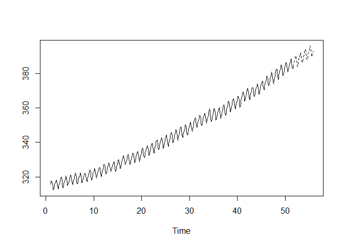
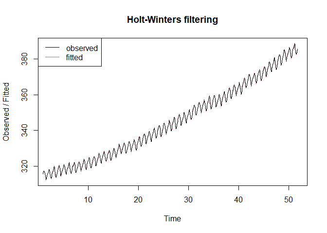

Apply Holt-Winters filtering to the Mauna Loa data. Plot the original data and the
one-step fitted values. Plot the Holt-Winters predictors for the next four years. 
Try this with both additive and multiplicative seasonal models. Which is best 
(i.e. which gives better prediction)?


```r
www = "https://www.mimuw.edu.pl/~noble/courses/TimeSeries/data/atmospheric-carbon-dioxide-recor.csv"
carbon = read.csv(www)
carbon = carbon[-611,]
y = carbon$MaunaLoaCO2
MaunLoaCo2 = ts(data = y, frequency = 12)
plot(MaunLoaCo2)
```

<!-- -->


```r
output.stl = stl(MaunLoaCo2, s.window = "periodic")
plot(output.stl)
```

<!-- -->


```r
MaunLoaCo2 = ts(data = y, frequency = 12)
output.stl = stl(MaunLoaCo2, s.window = "periodic")
plot(output.stl)
```

<!-- -->


```r
a <- output.stl$time.series
acf(a)
```

<!-- -->


```r
apply(a,2,sd)
```

```
##   seasonal      trend  remainder 
##  2.0402413 21.0085895  0.2735003
```


```r
MaunLoaCo2_mult.hw <- HoltWinters(MaunLoaCo2,seasonal="mult")
plot(MaunLoaCo2_mult.hw)
legend("topleft",c("observed","fitted"),lty=1,col=1:2)
```

<!-- -->


```r
MaunLoaCo2_mult.predict <-predict(MaunLoaCo2_mult.hw,n.ahead=4*12)
ts.plot(MaunLoaCo2,MaunLoaCo2_mult.predict,lty=1:2)
```

<!-- -->


```r
MaunLoaCo2_add.hw <- HoltWinters(MaunLoaCo2,seasonal="additive")
plot(MaunLoaCo2_add.hw)
legend("topleft",c("observed","fitted"),lty=1,col=1:2)
```

<!-- -->


```r
MaunLoaCo2_add.predict <-predict(MaunLoaCo2_add.hw,n.ahead=4*12)
ts.plot(MaunLoaCo2,MaunLoaCo2_add.predict,lty=1:2)
```

<!-- -->


