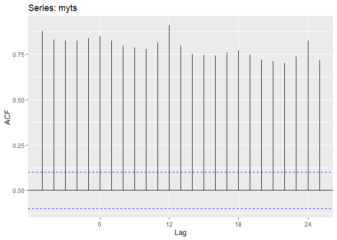

# Task 2
Use the help function to explore what the series gold, woolyrnq and gas represent from the fpp2 package.
<br>
a) Use autoplot() to plot each of these in separate plots.
<br>
b) What is the frequency of each serier? HINT: apply the frequency() function.
<br>
c) Use which.max() to spot the outlier in the gold series. Which observation is it?


```r
tsdisplay(gold)
```

<!-- -->


```r
autoplot(gold)
```

<!-- -->


```r
gf <- frequency(gold)
print(paste0("The frequency for the gold time series data is: ", gf, "."))
```

```
## [1] "The frequency for the gold time series data is: 1."
```


```r
go <- which.max(gold)

print(paste0("The outlier is: ", go, "."))
```

```
## [1] "The outlier is: 770."
```


```r
tsdisplay(woolyrnq)
```

<!-- -->


```r
autoplot(woolyrnq)
```

<!-- -->


```r
wf <- frequency(woolyrnq)
print(paste0("The frequency for the woolyrnq time series data is: ", wf, "."))
```

```
## [1] "The frequency for the woolyrnq time series data is: 4."
```


```r
plot(gas)
```

<!-- -->


```r
seasonplot(gas)
```

<!-- -->


```r
tsdisplay(gas)
```

<!-- -->


```r
autoplot(gas)
```

<!-- -->


```r
gf <- frequency(gas)
print(paste0("The frequency for the gas time series data is: ", gf, "."))
```

```
## [1] "The frequency for the gas time series data is: 12."
```


# Task 3
The file tute1.csv is in the course data directory, Open in Excel (or some other spreadsheet application), and review its contents. You should find four columns of information. Columns B through D each contain a quaterly series, labelled Sales, AdBudget and GDP. Sales contains the quaterly sales for a small company over the period 1981-2005. AdBudget is the advertising budget and GDP is the gross domestic product, All series have been adjusted for inflation. 
<br>
a) Read the data into R.


```r
www_tute = "https://www.mimuw.edu.pl/~noble/courses/TimeSeries/data/tute1.csv"
tute1 <- read.csv(www_tute, header = TRUE)
```
b) Convert the data to time series


```r
mytimeseries <- ts(tute1[,-1], start=1981, frequency = 4)
```

c) Construct time series plot of each of the three series


```r
autoplot(mytimeseries, facets = TRUE)
```

<!-- -->


Find out what 'facets' does and check what happens when you don't include facets=TRUE.


```r
autoplot(mytimeseries)
```

<!-- -->


# Task 4
The file retail.xlsx in the course data directory contains some monthly Australian retail data. These represent retail sales in various categories for different Australian states, and are stored in a MS-Excel file. 
<br>
a) Data of this format can be read into R with the followinf (suitably modified to take into account where the data is stored):


```r
retaildata <- readxl::read_excel("retail.xlsx", skip=1)
```
The second argument (skip=1) is required because the Excel sheet has two header rows. 
<br>
b) Select one of the time series as follows:


```r
myts <- ts(retaildata[,"A3349564W"], frequency = 12, start = c(1982, 4))
```
c) Explore tour chosen retail time series using the following functions:


```r
autoplot(myts)
```

<!-- -->


```r
ggseasonplot(myts, polar = TRUE)
```

<!-- -->


```r
ggsubseriesplot(myts)
```

<!-- -->


```r
gglagplot(myts)
```

<!-- -->


```r
ggAcf(myts)
```

<!-- -->
