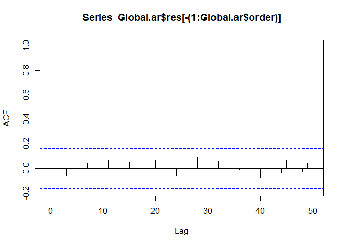
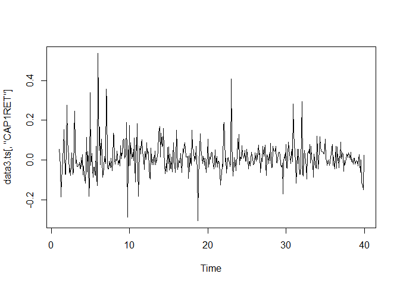
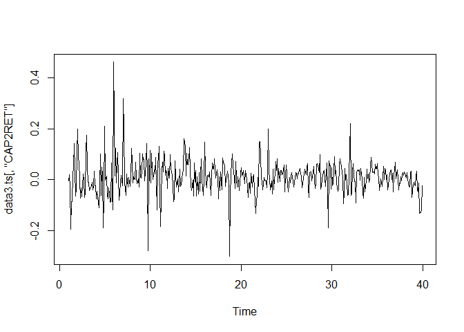
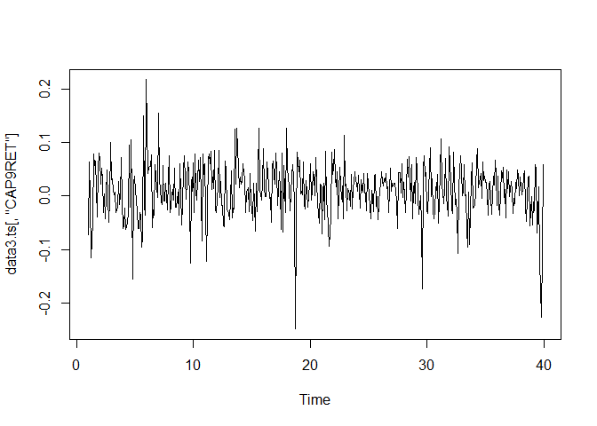
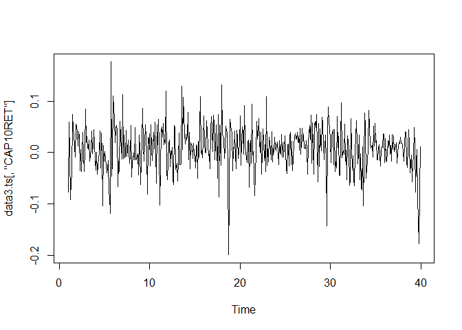
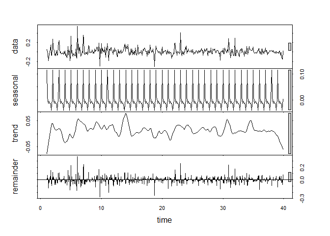
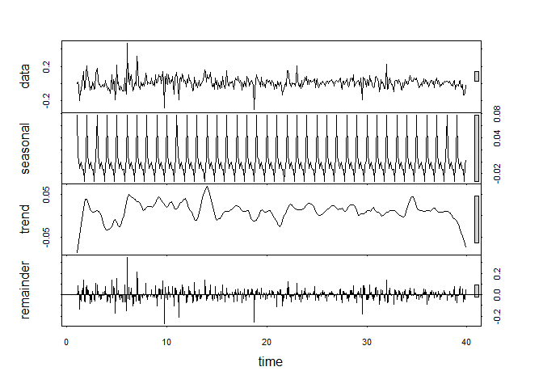
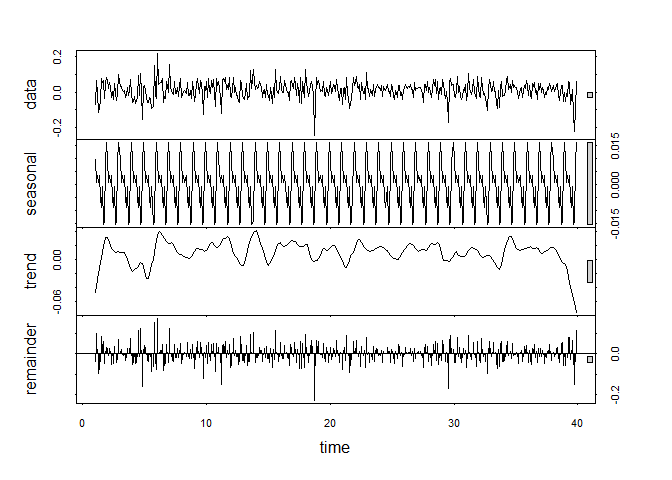
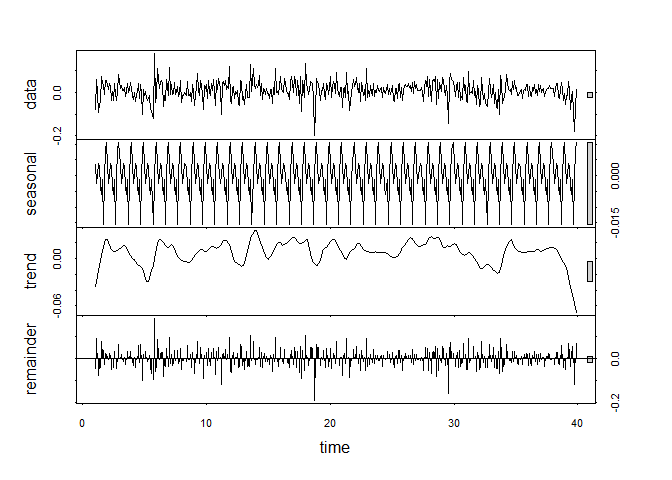
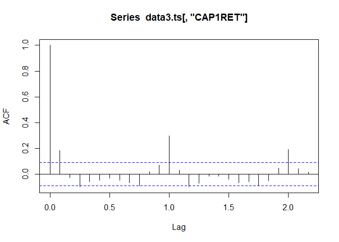

# Task 2

a) Refit the AR(4) model to the global temperature data and use the fitted model to create a series of predicted values from \(t=2\) to the last value in the series. Create a residual series from the difference between the predicted values and the observed value and verify that the series is identical (within computational accuracy) to the series extracted from the fitted model in R.

```r
www ="https://www.mimuw.edu.pl/~noble/courses/TimeSeries/data/global.dat"
Global = scan(www)
Global.ts = ts(Global, st = c(1856, 1), end = c(2005, 12),
fr = 12)

Global.ar <- ar(aggregate(Global.ts, FUN = mean), method="mle")
```

```
## Warning in arima0(x, order = c(i, 0L, 0L), include.mean = demean): possible
## convergence problem: optim gave code = 1
```

```r
mean(aggregate(Global.ts, FUN = mean))
```

```
## [1] -0.1382628
```

```r
Global.ar$order
```

```
## [1] 4
```

```r
Global.ar$ar
```

```
## [1] 0.58762026 0.01260254 0.11116731 0.26763656
```

```r
acf(Global.ar$res[-(1:Global.ar$order)], lag = 50)
```

<!-- -->
b) Plot the acf of the residuals of the fitted model. Comment on the plots.

c) Use the predict function in R to forecast 100 years of the future values for the annual global temperature series using the fitted AR(4) model.

d) Create a time plot of the mean annual temperature series and add the 100-year forecast to the plot. Use a different symbol or colour for the forecasts.

e) Add a line representing the overall mean global temperature. Comment on the final plot and any potencial inadequacies in the fitted model.


# Task 3

The dataset m-deciles08.txt contains the monthly simple returns of the CRSP Decile 1 Index from January 1970 to December 2008, for 468 observations. First, make time series plot. Is there any apparent seasonality? What is the sample ACF? What are the significant lags?

```r
www = "https://www.mimuw.edu.pl/~noble/courses/TimeSeries/data/m-deciles08.txt"
data3 <- read.table(www, header=T)
data3.ts = ts(data3, fr=12)
plot(data3.ts[,"CAP1RET"])
```

<!-- -->

```r
plot(data3.ts[,"CAP2RET"])
```

<!-- -->

```r
plot(data3.ts[,"CAP9RET"])
```

<!-- -->

```r
plot(data3.ts[,"CAP10RET"])
```

<!-- -->

```r
data3.stl = stl(data3.ts[,"CAP1RET"], s.window = "periodic")
plot(data3.stl)
```

<!-- -->

```r
data3.stl = stl(data3.ts[,"CAP2RET"], s.window = "periodic")
plot(data3.stl)
```

<!-- -->

```r
data3.stl = stl(data3.ts[,"CAP9RET"], s.window = "periodic")
plot(data3.stl)
```

<!-- -->

```r
data3.stl = stl(data3.ts[,"CAP10RET"], s.window = "periodic")
plot(data3.stl)
```

<!-- -->


```r
acf(data3.ts[,"CAP1RET"])
```

<!-- -->

The seasonal ARMA model for a process with lags at 1, and \(12k\) for \(k \geq 1\), would be:
\[(1-\phi_1B)(1-\phi_{12}B^{12})X_t = (1-\theta_{12}B^{12})Z_t, \quad \{Z_t\} \sim WN(0, \sigma^2)\]
Whate are the parameter estimates \(\phi_1, \phi_{12}\) and \(\theta_{12}\) for such model?

```r
data3.auto <- auto.arima(data3.ts[,"CAP1RET"], max.d = 0)
data3.auto
```

```
## Series: data3.ts[, "CAP1RET"] 
## ARIMA(1,0,0)(1,0,0)[12] with non-zero mean 
## 
## Coefficients:
##          ar1    sar1    mean
##       0.1831  0.3065  0.0124
## s.e.  0.0454  0.0445  0.0058
## 
## sigma^2 estimated as 0.00524:  log likelihood=565.66
## AIC=-1123.32   AICc=-1123.24   BIC=-1106.73
```

The seasonal behaviour might be deterministic. Try to create a dummy varaible 
\[J = \begin{cases} 1 & \text{January} \\
0 & \text{otherwise}\end{cases}\]
and make a regression
\[X_t = \beta_0 + \beta_1 J_t + \varepsilon_t.\]
What is the fitted model? Does it fit the data well? What do you conclude about the 'January effect'?

```r
d1 = data3.ts[,"CAP1RET"]
jan = rep(c(1, rep(0, 11)), 39)
m1 = lm(d1~jan)
summary(m1)
```

```
## 
## Call:
## lm(formula = d1 ~ jan)
## 
## Residuals:
##      Min       1Q   Median       3Q      Max 
## -0.30861 -0.03475 -0.00176  0.03254  0.40671 
## 
## Coefficients:
##             Estimate Std. Error t value Pr(>|t|)    
## (Intercept) 0.002864   0.003333   0.859    0.391    
## jan         0.125251   0.011546  10.848   <2e-16 ***
## ---
## Signif. codes:  0 '***' 0.001 '**' 0.01 '*' 0.05 '.' 0.1 ' ' 1
## 
## Residual standard error: 0.06904 on 466 degrees of freedom
## Multiple R-squared:  0.2016,	Adjusted R-squared:  0.1999 
## F-statistic: 117.7 on 1 and 466 DF,  p-value: < 2.2e-16
```
