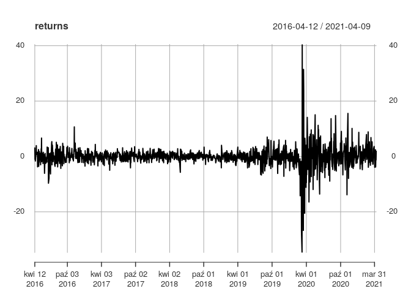
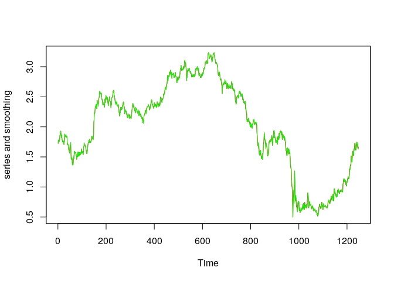
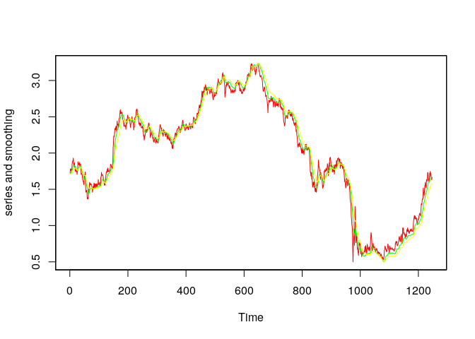
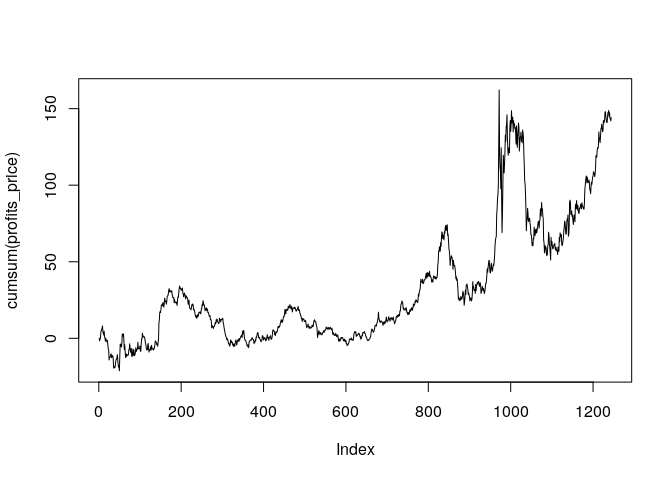

# Task

Follow through the analysis given above with a different data set. For example, find US 10 year bond data from yahoo finance and try the same thing: fit various ARMA models, apply Holt Winters filtering as described above and examine the possibility of making profit from the simple trading strategy suggested. Compute the Sharpe ratio for the data.


```r
table <- read.csv('yahoo.csv', sep=",", na.strings = "null")
table = na.omit(table)
head(table)
```

```
##         Date  Open  High   Low Close Adj.Close Volume
## 1 2016-04-11 1.736 1.755 1.713 1.724     1.724      0
## 2 2016-04-12 1.757 1.783 1.748 1.781     1.781      0
## 3 2016-04-13 1.792 1.795 1.757 1.762     1.762      0
## 4 2016-04-14 1.795 1.804 1.771 1.781     1.781      0
## 5 2016-04-15 1.771 1.782 1.740 1.752     1.752      0
## 7 2016-04-18 1.743 1.787 1.741 1.773     1.773      0
```


```r
Index <-as.Date(table$Date,"%Y-%m-%d")
price<-xts(table$Close,Index)
returns <- 100*diff(log(price),na.pad=FALSE)
plot(returns)
```

<!-- -->

# ARMA models


```r
arima(returns,c(1,0,0),include.mean=FALSE)
```

```
## 
## Call:
## arima(x = returns, order = c(1, 0, 0), include.mean = FALSE)
## 
## Coefficients:
##           ar1
##       -0.0073
## s.e.   0.0283
## 
## sigma^2 estimated as 13.68:  log likelihood = -3397.61,  aic = 6799.22
```

```r
arima(returns,c(1,0,1),include.mean=FALSE)
```

```
## 
## Call:
## arima(x = returns, order = c(1, 0, 1), include.mean = FALSE)
## 
## Coefficients:
##          ar1      ma1
##       0.7319  -0.7933
## s.e.  0.0800   0.0703
## 
## sigma^2 estimated as 13.57:  log likelihood = -3392.61,  aic = 6791.22
```

```r
arima(returns,c(0,0,0),include.mean=FALSE)
```

```
## 
## Call:
## arima(x = returns, order = c(0, 0, 0), include.mean = FALSE)
## 
## 
## sigma^2 estimated as 13.68:  log likelihood = -3397.64,  aic = 6797.28
```

```r
auto.arima(returns, max.d = 0)
```

```
## Series: returns 
## ARIMA(4,0,5) with zero mean 
## 
## Coefficients:
##           ar1      ar2      ar3      ar4     ma1     ma2     ma3     ma4
##       -0.2693  -1.0083  -0.3466  -0.4382  0.2571  0.9720  0.2759  0.2952
## s.e.   0.1575   0.1530   0.1246   0.1340  0.1583  0.1587  0.1274  0.1363
##          ma5
##       0.0687
## s.e.  0.0471
## 
## sigma^2 estimated as 12.72:  log likelihood=-3347.94
## AIC=6715.88   AICc=6716.06   BIC=6767.16
```
# Holt Winters filtering


```r
pr<-HoltWinters(price,beta=FALSE,gamma=FALSE)
plot(pr$x,col="red",ylab="series and smoothing")
par(new=TRUE)
plot(pr$fitted[,1],col="green",xaxt="n",yaxt="n",xlab="", ylab="")
```

<!-- -->

```r
pr<-HoltWinters(price,alpha=0.1,beta=FALSE,gamma=FALSE)
plot(pr$x,col="red",ylab="series and smoothing")
par(new=TRUE)
plot(pr$fitted[,1],col="green",xaxt="n",yaxt="n",xlab="", ylab="")
```

<!-- -->

```r
pr12 <-HoltWinters(price,alpha=2/(12+1),beta=FALSE,gamma=FALSE)$fitted[,1]
pr26<-HoltWinters(price,alpha=2/(26+1),beta=FALSE,gamma=FALSE)$fitted[,1]
plot(pr$x,col="red",ylab="series and smoothing")
par(new=TRUE)
plot(pr12,col="green",xaxt="n",yaxt="n",xlab="", ylab="")
par(new=TRUE)
plot(pr26,col="yellow",xaxt="n",yaxt="n",xlab="", ylab="")
```

<!-- -->

```r
forecast<-sign(pr12-pr26)
profits_price <-lag(forecast,-1)*as.ts(returns) 
plot(cumsum(profits_price),type="l")
```

<!-- -->

# Sharpe ratio test
  

```r
sr <- function(X){
  if (is.null(dim(X))) X <- as.matrix(X)
  sqrt(1339) * colMeans(X,na.rm="TRUE") / sd(X,na.rm="TRUE")}
sr(profits_price)
```

```
## [1] 1.1458
```
