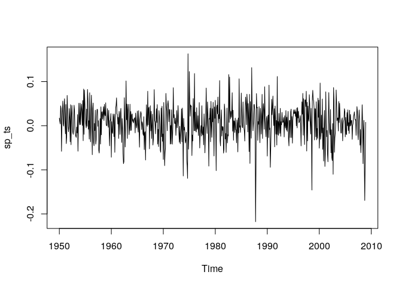
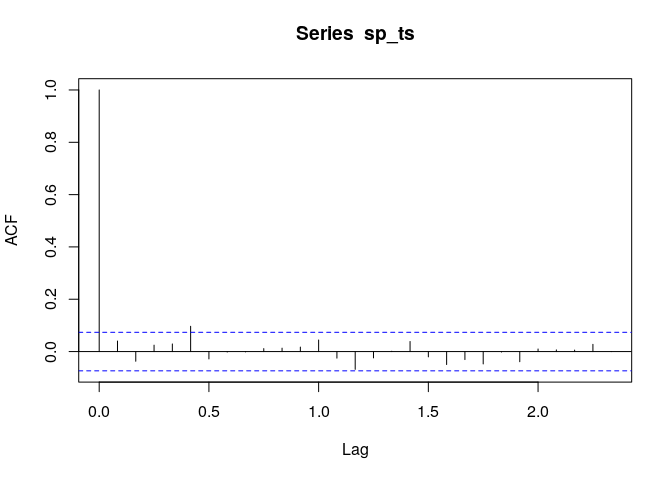
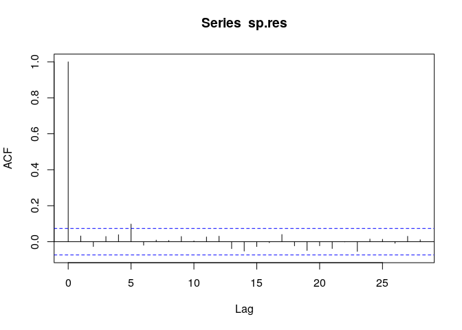
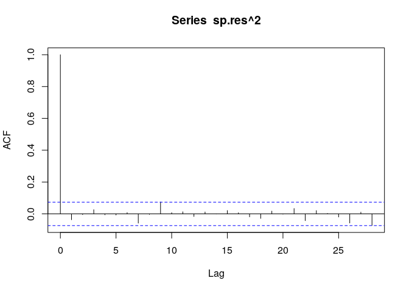
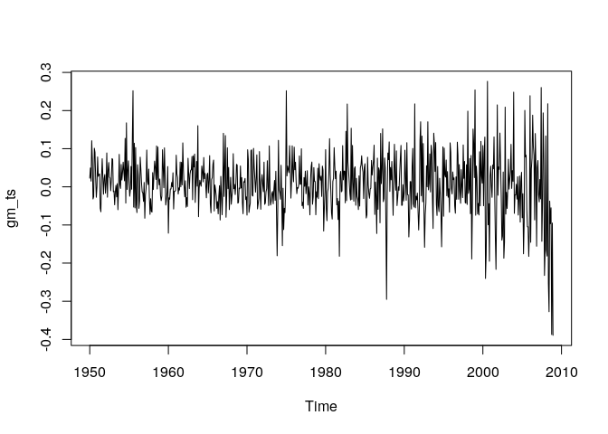
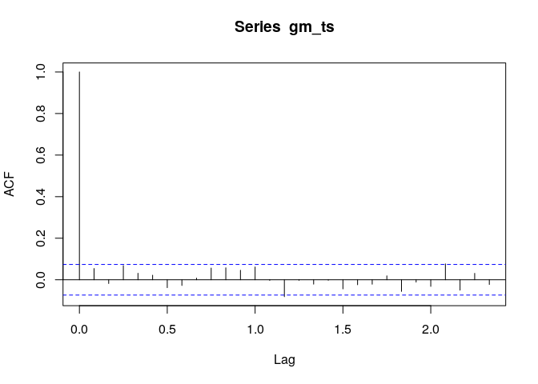
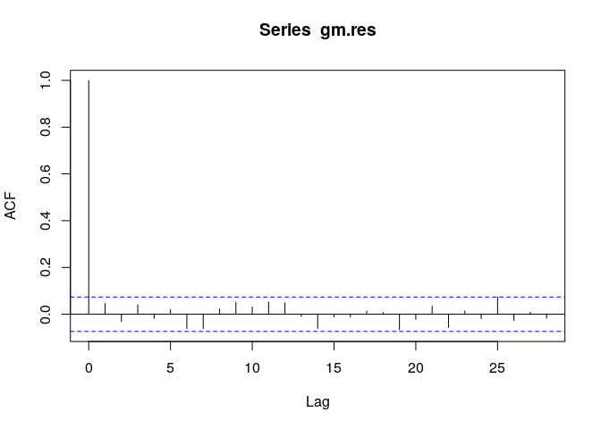
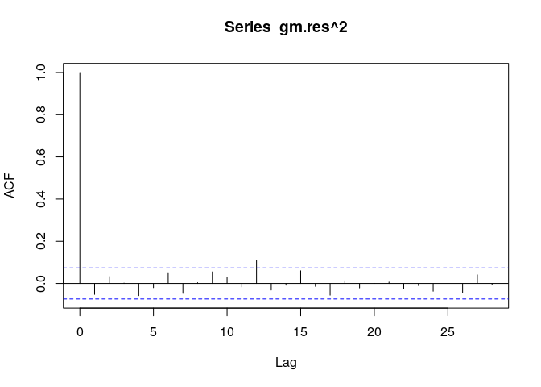

Data loading:

```r
www = "https://www.mimuw.edu.pl/~noble/courses/TimeSeries/data/m-gmsp5008.txt"
m_gmsp5008 <- read.table(www, header=T)
sp_ts = ts(m_gmsp5008$sp, start= c(1950, 01), end = c(2008,12), frequency = 12)
plot(sp_ts, type= 'l')
```

<!-- -->

```r
acf(sp_ts)
```

<!-- -->


a) Build a Gaussian GARCH model for monthly log return of the S&P 500 index. 

```r
sp.garch <- garch(sp_ts, trace=FALSE)
sp.res <- sp.garch$res[-1]
acf(sp.res)
```

<!-- -->

```r
acf(sp.res^2)
```

<!-- -->

Both correlograms suggest that the residuals of the fitted GARCH model behave like white noise, indicating a satisfactory fit has been obtained. 
<br>


```r
sp500fit = garchFit(~arma(3,0)+garch(1,1), data=sp_ts, trace=F)
summary(sp500fit)
```

```
## 
## Title:
##  GARCH Modelling 
## 
## Call:
##  garchFit(formula = ~arma(3, 0) + garch(1, 1), data = sp_ts, trace = F) 
## 
## Mean and Variance Equation:
##  data ~ arma(3, 0) + garch(1, 1)
## <environment: 0x55efce4c5d50>
##  [data = sp_ts]
## 
## Conditional Distribution:
##  norm 
## 
## Coefficient(s):
##          mu          ar1          ar2          ar3        omega       alpha1  
##  7.1284e-03   1.9290e-02  -4.2114e-02   1.6513e-02   7.9652e-05   1.1366e-01  
##       beta1  
##  8.4816e-01  
## 
## Std. Errors:
##  based on Hessian 
## 
## Error Analysis:
##          Estimate  Std. Error  t value Pr(>|t|)    
## mu      7.128e-03   1.499e-03    4.755 1.99e-06 ***
## ar1     1.929e-02   4.107e-02    0.470   0.6385    
## ar2    -4.211e-02   4.051e-02   -1.040   0.2985    
## ar3     1.651e-02   3.936e-02    0.420   0.6748    
## omega   7.965e-05   3.355e-05    2.374   0.0176 *  
## alpha1  1.137e-01   2.659e-02    4.275 1.91e-05 ***
## beta1   8.482e-01   2.892e-02   29.330  < 2e-16 ***
## ---
## Signif. codes:  0 '***' 0.001 '**' 0.01 '*' 0.05 '.' 0.1 ' ' 1
## 
## Log Likelihood:
##  1273.601    normalized:  1.798871 
## 
## Description:
##  Thu May 27 22:00:31 2021 by user: emilia 
## 
## 
## Standardised Residuals Tests:
##                                 Statistic p-Value     
##  Jarque-Bera Test   R    Chi^2  69.75041  6.661338e-16
##  Shapiro-Wilk Test  R    W      0.9843575 7.145384e-07
##  Ljung-Box Test     R    Q(10)  8.939989  0.5378082   
##  Ljung-Box Test     R    Q(15)  13.87093  0.5353401   
##  Ljung-Box Test     R    Q(20)  17.76692  0.6027591   
##  Ljung-Box Test     R^2  Q(10)  7.460676  0.6813552   
##  Ljung-Box Test     R^2  Q(15)  8.389826  0.9072052   
##  Ljung-Box Test     R^2  Q(20)  9.440223  0.9772248   
##  LM Arch Test       R    TR^2   7.598162  0.815692    
## 
## Information Criterion Statistics:
##       AIC       BIC       SIC      HQIC 
## -3.577968 -3.532859 -3.578161 -3.560539
```

b) Is there a summer effect on the volatility of the index return?
Make a variable 
\[u_t = \begin{cases} 1 & \text{for months: June, July, August} \\
0 & \text{for other months.}\end{cases}\]
Try fitting the model:
\[\sigma^2(t) = \alpha X^2 (t-1) + \beta \sigma^2(t-1) + \gamma(1 - u_t)\]
Then the coefficients are \((\alpha, \beta, \gamma)\) for September to May and \((\alpha, \beta, 0)\) for June, July and August. Is \(\gamma\), which represents the difference, signinificant?


```r
u_t <- function(var){
  month = floor((var %% 10000)/100)
  if(month == 6 | month == 7 | month == 8){
    return (1)
  }
  else{
    return (0)
  }
}
```


```r
summer <- c(0,0,0,0,0,1,1,1,0,0,0,0)
Sum <- rep(summer, 59)
Sum <- as.matrix(Sum)
spec = ugarchspec(variance.model = list(model='sGARCH', garchOrder = c(1,1), external.regressors=Sum), mean.model = list(armaOrder=c(0,0), distribution.model='std'))
```

```
## Warning: unidentified option(s) in mean.model:
##  distribution.model
```

```r
fit = ugarchfit(data=m_gmsp5008$sp, spec=spec)
round(fit@fit$matcoef, 6)
```

```
##         Estimate  Std. Error   t value Pr(>|t|)
## mu      0.007147    0.001425  5.017022 0.000001
## omega   0.000032    0.000038  0.826427 0.408562
## alpha1  0.101576    0.026392  3.848687 0.000119
## beta1   0.846108    0.031392 26.952826 0.000000
## vxreg1  0.000268    0.000115  2.338066 0.019384
```

The parameter lambda is vxreg1 in our model. T value is equal to 2.338066, which means it's statistically significant.

<br>

Are the lagged returns of GM stock useful for modelling the index volatility? USE your GARCH model as a baseline for comparison.

```r
gm_ts = ts(m_gmsp5008$gm, start= c(1950, 01), end = c(2008,12), frequency = 12)
plot(gm_ts, type= 'l')
```

<!-- -->

```r
acf(gm_ts)
```

<!-- -->

```r
gm.garch <- garch(gm_ts, trace=FALSE)
gm.res <- gm.garch$res[-1]
acf(gm.res)
```

<!-- -->

```r
acf(gm.res^2)
```

<!-- -->

```r
gm500fit = garchFit(~arma(3,0)+garch(1,1), data=gm_ts, trace=F)
summary(gm500fit)
```

```
## 
## Title:
##  GARCH Modelling 
## 
## Call:
##  garchFit(formula = ~arma(3, 0) + garch(1, 1), data = gm_ts, trace = F) 
## 
## Mean and Variance Equation:
##  data ~ arma(3, 0) + garch(1, 1)
## <environment: 0x55efcbb76648>
##  [data = gm_ts]
## 
## Conditional Distribution:
##  norm 
## 
## Coefficient(s):
##          mu          ar1          ar2          ar3        omega       alpha1  
##  0.01083183   0.05711266  -0.04279013   0.01949961   0.00011125   0.10307557  
##       beta1  
##  0.88582030  
## 
## Std. Errors:
##  based on Hessian 
## 
## Error Analysis:
##          Estimate  Std. Error  t value Pr(>|t|)    
## mu      1.083e-02   2.489e-03    4.352 1.35e-05 ***
## ar1     5.711e-02   3.953e-02    1.445   0.1485    
## ar2    -4.279e-02   4.019e-02   -1.065   0.2870    
## ar3     1.950e-02   3.954e-02    0.493   0.6219    
## omega   1.112e-04   6.012e-05    1.851   0.0642 .  
## alpha1  1.031e-01   2.369e-02    4.351 1.35e-05 ***
## beta1   8.858e-01   2.632e-02   33.650  < 2e-16 ***
## ---
## Signif. codes:  0 '***' 0.001 '**' 0.01 '*' 0.05 '.' 0.1 ' ' 1
## 
## Log Likelihood:
##  870.6694    normalized:  1.229759 
## 
## Description:
##  Thu May 27 22:00:31 2021 by user: emilia 
## 
## 
## Standardised Residuals Tests:
##                                 Statistic p-Value     
##  Jarque-Bera Test   R    Chi^2  20.17247  4.164889e-05
##  Shapiro-Wilk Test  R    W      0.9909099 0.000236162 
##  Ljung-Box Test     R    Q(10)  8.860885  0.5453552   
##  Ljung-Box Test     R    Q(15)  14.59028  0.4813123   
##  Ljung-Box Test     R    Q(20)  18.47383  0.556225    
##  Ljung-Box Test     R^2  Q(10)  9.625037  0.4739824   
##  Ljung-Box Test     R^2  Q(15)  20.90861  0.1397748   
##  Ljung-Box Test     R^2  Q(20)  24.24148  0.232003    
##  LM Arch Test       R    TR^2   17.71585  0.1245948   
## 
## Information Criterion Statistics:
##       AIC       BIC       SIC      HQIC 
## -2.439744 -2.394635 -2.439937 -2.422316
```

```r
summary(sp500fit)
```

```
## 
## Title:
##  GARCH Modelling 
## 
## Call:
##  garchFit(formula = ~arma(3, 0) + garch(1, 1), data = sp_ts, trace = F) 
## 
## Mean and Variance Equation:
##  data ~ arma(3, 0) + garch(1, 1)
## <environment: 0x55efce4c5d50>
##  [data = sp_ts]
## 
## Conditional Distribution:
##  norm 
## 
## Coefficient(s):
##          mu          ar1          ar2          ar3        omega       alpha1  
##  7.1284e-03   1.9290e-02  -4.2114e-02   1.6513e-02   7.9652e-05   1.1366e-01  
##       beta1  
##  8.4816e-01  
## 
## Std. Errors:
##  based on Hessian 
## 
## Error Analysis:
##          Estimate  Std. Error  t value Pr(>|t|)    
## mu      7.128e-03   1.499e-03    4.755 1.99e-06 ***
## ar1     1.929e-02   4.107e-02    0.470   0.6385    
## ar2    -4.211e-02   4.051e-02   -1.040   0.2985    
## ar3     1.651e-02   3.936e-02    0.420   0.6748    
## omega   7.965e-05   3.355e-05    2.374   0.0176 *  
## alpha1  1.137e-01   2.659e-02    4.275 1.91e-05 ***
## beta1   8.482e-01   2.892e-02   29.330  < 2e-16 ***
## ---
## Signif. codes:  0 '***' 0.001 '**' 0.01 '*' 0.05 '.' 0.1 ' ' 1
## 
## Log Likelihood:
##  1273.601    normalized:  1.798871 
## 
## Description:
##  Thu May 27 22:00:31 2021 by user: emilia 
## 
## 
## Standardised Residuals Tests:
##                                 Statistic p-Value     
##  Jarque-Bera Test   R    Chi^2  69.75041  6.661338e-16
##  Shapiro-Wilk Test  R    W      0.9843575 7.145384e-07
##  Ljung-Box Test     R    Q(10)  8.939989  0.5378082   
##  Ljung-Box Test     R    Q(15)  13.87093  0.5353401   
##  Ljung-Box Test     R    Q(20)  17.76692  0.6027591   
##  Ljung-Box Test     R^2  Q(10)  7.460676  0.6813552   
##  Ljung-Box Test     R^2  Q(15)  8.389826  0.9072052   
##  Ljung-Box Test     R^2  Q(20)  9.440223  0.9772248   
##  LM Arch Test       R    TR^2   7.598162  0.815692    
## 
## Information Criterion Statistics:
##       AIC       BIC       SIC      HQIC 
## -3.577968 -3.532859 -3.578161 -3.560539
```

Based on log likelihood, the lagged returns o GM stock is useful for modelling the index volatility.
